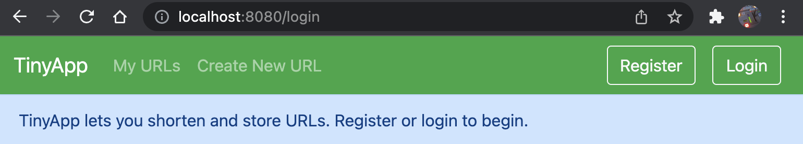
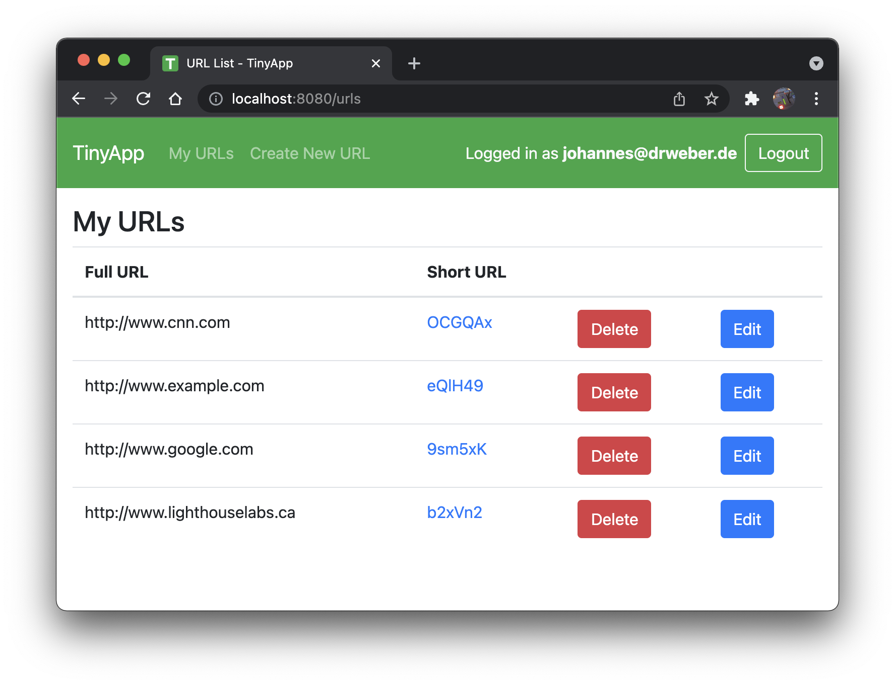
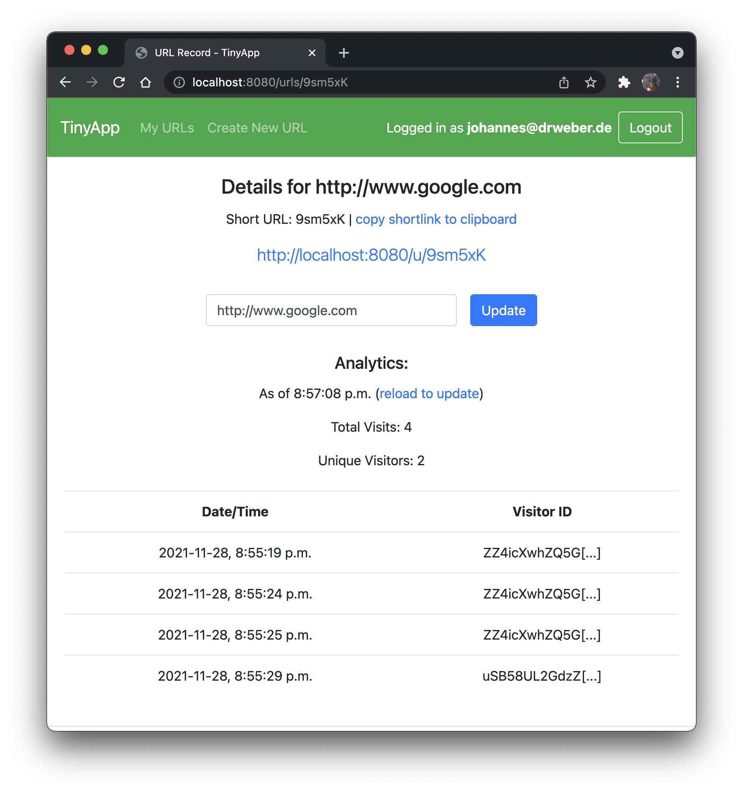

# TinyApp

A URL-shortening app. 
(Lighthouse Labs Flex Program Module 3 Project)

## Features:

### Keep a catalogue of shortened URLs:
Unwieldy URLs like
* ```http://www.lighthouselabs.com``` (okay that one's not so unwieldy), or
* ```https://www.facebook.com/photo/?fbid=10204711107795638&set=a.2317713580351```, or
* ```https://www.amazon.ca/blackfriday?ref_=CA_BF21_DO_GW_DeskTab_ATFCard&pf_rd_r=VWYGH62D6HKK171SRWD4&pf_rd_p=4c112fb5-d76d-4e32-8f98-3b20651f9423&pd_rd_r=42c5f9c7-4972-4bd3-b929-3fa596579e03&pd_rd_w=OuWJ1&pd_rd_wg=8lGTD```, or
* ...you get the idea!

become something like: ```[app]/u/ZcnjuZ```

## Instructions
### Install it:
```bash
git clone https://github.com/jowe81/tinyapp
cd tinyapp
npm install
```
### Configure it:
* Visit the configuration file, ```constants.js``` to adjust TCP port, persistence, and security settings.
* Note that command line arguments take precedence over settings in ```constants.js```.

### Run it:
```bash
npm run tinyapp
```
Optional command line arguments:
```bash
npm run tinyapp -- [-port port] [-init-from-file true | false]
```
* Visit ```http://localhost:8080``` (or the port# you specifed) in your browser to use the app.

* Terminate the server with `q` or `CTRL + C`. If so specified in ```constants.js```, data will be persisted in the specified file in the ```./app_data``` directory.

* To force-terminate without persistence, irrespective of ```constants.js```, type `x`.

* To force-terminate with persistence, irrespective of ```constants.js```, type `s`.

## Dependencies

### Backend (Server)
* [bcrypt ^5.0.1](https://www.npmjs.com/package/bcrypt)
* [body-parser ^1.19.0](https://www.npmjs.com/package/body-parser)    
* [cookie-parser ^1.4.6](https://www.npmjs.com/package/cookie-parser)
* [method-override ^3.0.0](https://www.npmjs.com/package/method-override)
* [ejs ^3.1.6](https://www.npmjs.com/package/ejs)
* [express ^4.17.1](https://www.npmjs.com/package/express)
* [@jowe81/lg ^1.0.0](https://www.npmjs.com/package/@jowe81/lg)
* Developed on Node 15.14.0

### Frontend (Browser)
* [Bootstrap](http://getbootstrap.com)
* [JQuery](http://jquery.com)
* [Popper](popper.js.org)

## Screenshots
### URL Index Page

### URL Info Page


### LHL stretch requirements implemented:
* Method Override
* Analytics

### Little things implemented in addition the stretch requirements:
* Informative flash messages
* Redirects and flash messages instead of non-200 status codes and blank pages
* URL and email address sanity checks/verification with regular expressions
* Pre-focus input fields in forms
* Copy shortlink to clipboard functionality
* Sort list of URLs by lexically by long URL 
* App icon (favicon)
* Session, flash, and analytics middleware (from scratch)
* Informative console output (server side)
* Some client side (modularized) JS and CSS
* Database persistence 

### Some of the previous lerning put to use in this project:
* Promises (database persistence functions)
* Taking callbacks (middleware functions)
* Classes/objects (clientHelpers.js)
* Capture keystrokes (server)
* Command line arguments
* setTimeout (urls_show.ejs -> reload info page after following link)

### New learning outcomes
* Write middleware (express)
* Write routing middleware (express)
