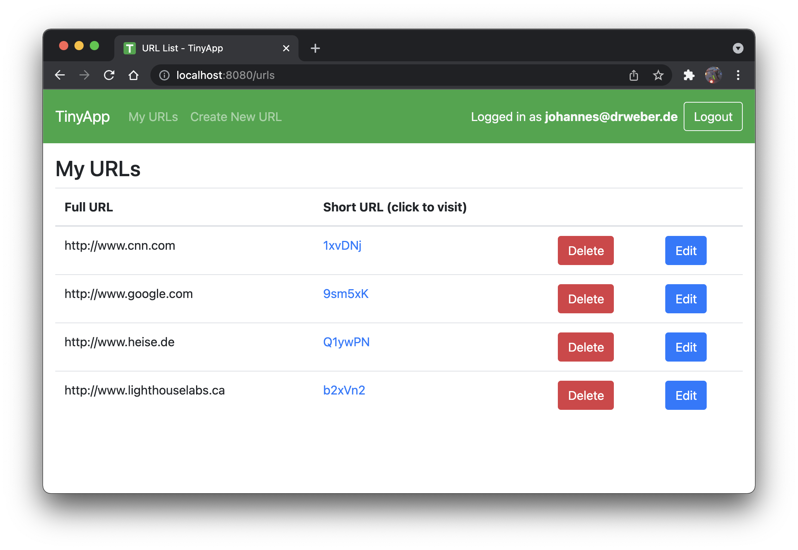

# TinyApp

A URL-shortening app. 
(Lighthouse Labs Flex Program Module 2 Project)

## Features:

### Keep a catalogue of shortened URLs:
Unwieldy URLs like
* ```https://www.facebook.com/photo/?fbid=10204711107795638&set=a.2317713580351```, or
* ```https://www.amazon.ca/blackfriday?ref_=CA_BF21_DO_GW_DeskTab_ATFCard&pf_rd_r=VWYGH62D6HKK171SRWD4&pf_rd_p=4c112fb5-d76d-4e32-8f98-3b20651f9423&pd_rd_r=42c5f9c7-4972-4bd3-b929-3fa596579e03&pd_rd_w=OuWJ1&pd_rd_wg=8lGTD```, or
* ...you get the idea!

become something like: ```[path to app]/urls/ZcnjuZ```

### Little things implemented in addition to the LHL requirements:
* Informative flash messages
* Flash messages and redirects instead of non-200 status codes
* URL sanity check/verification with regular expressions
* Pre-focus input fields
* Sort list of URLs by lexically by long URL 
* App icon (favicon )
* Session and flash middleware implemented from scratch
* Some console output (server side)

## Instructions
### Install it:
```bash
git clone https://github.com/jowe81/tinyapp
cd tinyapp
npm install
```
### Configure it:
* Visit the configuration file, ```constants.js``` to adjust the TCP port and security settings. Default port is 8080.
* Note that command line argument takes precedence over settings in ```constants.js```.

### Run it:
```bash
npm run tinyapp
```
With optional command line argument:
```bash
npm run tinyapp -- [port]
```
Terminate the server with `CTRL + C`.

## Screenshot


## Dependencies
* [chalk ^4.1.2](https://www.npmjs.com/package/chalk)
* [bcrypt ^5.0.1](https://www.npmjs.com/package/bcrypt)
* [body-parser ^1.19.0](https://www.npmjs.com/package/body-parser)    
* [cookie-parser ^1.4.6](https://www.npmjs.com/package/cookie-parser)
* [ejs ^3.1.6](https://www.npmjs.com/package/ejs)
* [express ^4.17.1](https://www.npmjs.com/package/express)
* [@jowe81/lg ^1.0.0](https://www.npmjs.com/package/@jowe81/lg)
